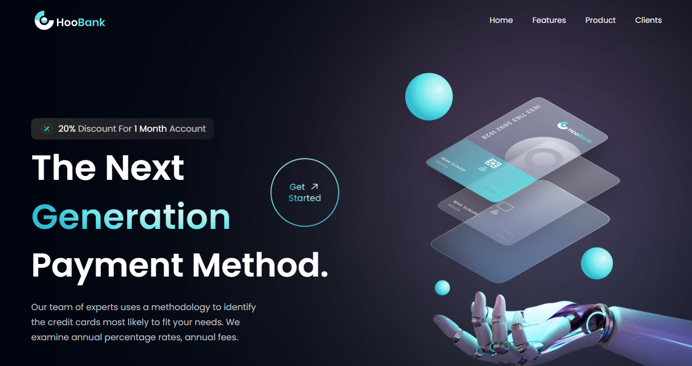

# HooBank - Modern UI/UX website using React.js & Tailwind CSS

### Showcase your dev skills with practical experience and land the coding career of your dreams
💻 JS Mastery Pro - https://jsmastery.pro/youtube
✅ A special YOUTUBE discount code is automatically applied!

📙 Get the Ultimate Frontend & Backend Development Roadmaps, a Complete JavaScript Cheatsheet, Portfolio Tips, and more - https://www.jsmastery.pro/links

# Personal Project: Mordern UI/UX Bank website 

This project was bootstrapped with [Create Vite App](https://vitejs.dev/).

Built using: 

- Front-end library: React.
- CSS animations library: Animate.css.
- CSS Framework: Tailwindcss

## Available Scripts

In the main folder, you can run:

### `npm run dev`

Runs the app in the development mode.\
Open [http://localhost:5173](http://localhost:5173) to view it in your browser.

The page will reload when you make changes.\
You may also see any lint errors in the console.

### `npm run build`

Builds the app for production to the `build` folder.\
It correctly bundles React in production mode and optimizes the build for the best performance.

The build is minified and the filenames include the hashes.\
Your app is ready to be deployed!

See the section about [deployment](https://facebook.github.io/create-react-app/docs/deployment) for more information.